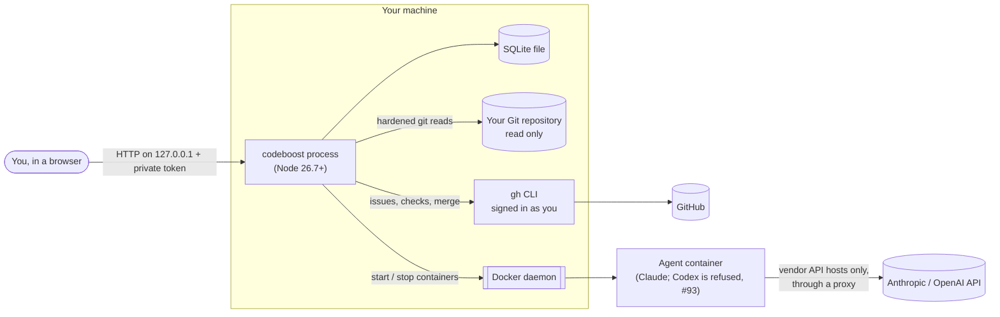
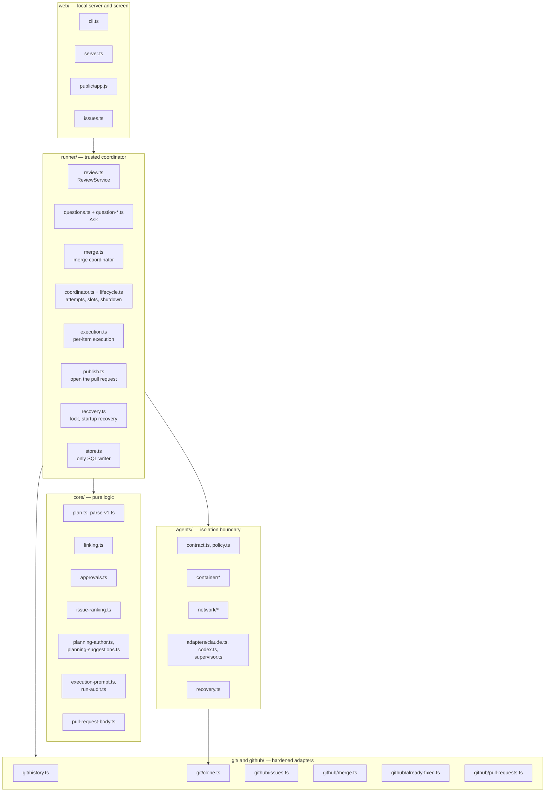
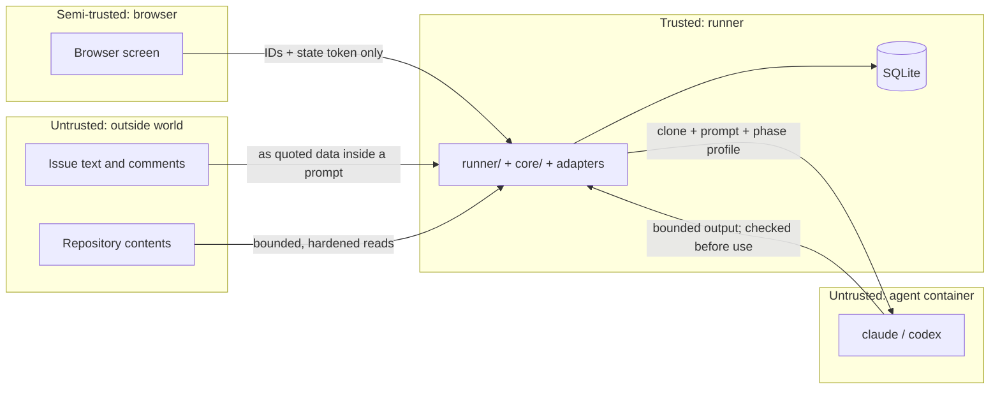
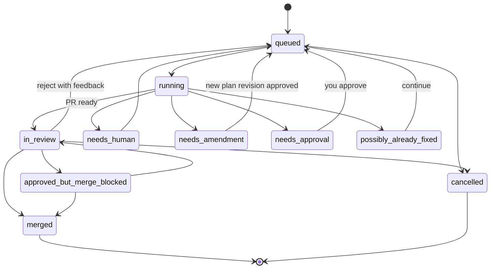

# codeboost architecture: a high-level overview

Status: current as of `main` at `aafd153` (2026-10-01). Open work is listed in **Build status and roadmap**.
Writing standard: plain language, ISO 24495-1:2023

## About this document

**Who it is for.** New contributors, reviewers, and anyone who needs to know how codeboost fits together before they read the code.

**What it is for.** It explains the parts of codeboost, what each part owns, how data moves between them, and where the trust boundaries are. It also says clearly which parts are built and which are only designed.

**What it is not.** It is not the product design and it does not repeat the detailed rules. When this document and a detailed document disagree, the detailed document wins:

| Topic | Detailed document |
|---|---|
| Product design, decisions and roadmap | [designs/codeboost-plan-indexed-review.md](designs/codeboost-plan-indexed-review.md) |
| Plan file format | [plan-format.md](plan-format.md) |
| SQLite store | [implementation/persistent-review-store.md](implementation/persistent-review-store.md) |
| Review screen | [implementation/read-only-review.md](implementation/read-only-review.md) |
| Agent container and network | [implementation/agent-isolation.md](implementation/agent-isolation.md) |
| Runner lifecycle (attempts, retries, shutdown) | [implementation/runner-lifecycle.md](implementation/runner-lifecycle.md) |
| Already-fixed check and opening the pull request | [implementation/pull-request-opening.md](implementation/pull-request-opening.md) |
| Merge gate and merge queue | [implementation/guarded-merge.md](implementation/guarded-merge.md), [implementation/merge-queue.md](implementation/merge-queue.md) |
| Issue ranking | [implementation/issue-prioritization.md](implementation/issue-prioritization.md) |
| Planning with an agent | [implementation/planning-provider.md](implementation/planning-provider.md), [implementation/planning-suggestions.md](implementation/planning-suggestions.md) |
| Visual design | [../DESIGN.md](../DESIGN.md) |

**How to read it.** Read the Summary first. It fits on one screen. Special words are in **Terms used**. Each later section stands on its own.

## Summary

- **What codeboost does.** It turns a GitHub issue into a plan, has an AI agent (Claude) carry out the plan, and lets you review the resulting pull request one plan item at a time. Then it merges the pull request, but only when every guard passes.
- **Shape of the system.** One local Node.js process. It serves a browser screen on `127.0.0.1`, keeps all state in one SQLite file, reads Git directly, talks to GitHub only through the `gh` command, and runs every agent inside a locked-down Docker container.
- **Five layers.**
  1. `web/` — the local HTTP server and browser screen.
  2. `runner/` — the trusted coordinator. It is the only code that writes the database and the only code that starts agents or merges.
  3. `core/` — pure logic with no input or output: plan validation, linking code to plan items, approvals, issue ranking, planning prompts.
  4. `git/` and `github/` — hardened adapters for Git and for the `gh` command.
  5. `agents/` — the isolation boundary: containers, the vendor-only network, and the Claude and Codex adapters.
- **The central idea.** A runner-owned **commit ledger** records which plan item each commit belongs to. The linking engine uses the ledger, not commit messages, to put every changed line on a plan item's row. Anything the ledger cannot explain goes to the Unplanned or Ambiguous row.
- **The central safety rule.** Everything that comes from outside is untrusted: issue text, agent output, the browser, and the repository's own files. Only the runner decides. Agents never see your credentials, your other files, or GitHub.
- **Build state.** Three levels:
  - **In use:** plan and linking library, SQLite store, review screen, Ask (questions to an agent), guarded merge with merge-queue support, ranked Issues screen, agent isolation boundary, and the single-runner lock.
  - **Built and tested, not yet connected:** the runner coordinator and `/api/runner`, the planning API, startup recovery, per-item execution with the post-run audit, the already-fixed check, and opening the pull request. They wait for the runner's commit in lane D (#66 part 2, PR #90) and the workspace follow-ups (#87).
  - **Not built:** rebasing, running `cmd:` checks, review rounds, continuing after a scope pause (#88), and the Planning, Queue and Learning screens.

## Terms used

One word means one thing in this document.

| Term | Meaning |
|---|---|
| Plan | The list of plan items for one GitHub issue. Each plan has revisions: r1, r2, and so on. |
| Plan item | One change in a plan, such as P1. It declares its files and its acceptance checks. |
| Declared files | The files a plan item says it will change. |
| Task | One issue's journey from plan to merge or cancel. Identified by repository ID, task ID and plan ID together. |
| Attempt | One agent run or one runner command for a task. A retry is a new attempt with a new ID. |
| Phase | The permission profile an attempt runs under: `planning`, `questions`, `review`, `execute` or `fix`. |
| Snapshot | A recorded base commit and head commit pair. Review decisions are bound to a snapshot. |
| Commit ledger | The runner's record of each commit it made: full SHA, owning plan item (or none), and origin (owned or foreign). |
| Segment | A run of changed lines, or one non-text file change, that has a single owner. The review screen shows segments. |
| Unplanned | A segment that no ledger entry explains. |
| Ambiguous | A segment that more than one plan item changed. |
| Approval | Your sign-off on one plan item, stored as a fingerprint of exactly what you saw. |
| Stale | An approval whose fingerprint no longer matches the current code, plan item or dependencies. |
| Runner | The trusted part of codeboost (`runner/`) that owns the database, starts attempts, and merges. |
| Agent container | The Docker container that runs one attempt with only the task clone and the agent's own sign-in. |
| Lane | A development workstream in the roadmap, such as lane D (agent isolation) or lane F (runner). |

## System context

codeboost runs on your machine for one person. It has no server on the internet.



| External system | How codeboost uses it | Who holds the credential |
|---|---|---|
| Browser | Shows the screens and sends review commands. | A random token made at start-up. |
| Git repository | Read-only history and file reads. codeboost never writes your checkout. | None. |
| GitHub | Issues, pull request state, branch rules, required checks, merge. Always through `gh`. | Your `gh` sign-in. Only the runner uses it. |
| Docker | Runs agent containers, the internal network and the egress proxy. | Local Docker socket. Never mounted into a container. |
| Claude or Codex API | The agent inside the container calls its own vendor. | `CLAUDE_CODE_OAUTH_TOKEN`, passed only into that container. Codex is refused in every phase for now ([why](implementation/agent-isolation.md#codex-is-refused-in-every-phase)); its `auth.json` would be passed the same way. |

## Building blocks

### Layer map



Dependencies point downward only. `core/` imports nothing that does input or output. `web/` never imports `store.ts` directly except to check the Node version at start-up.

### What each part owns

"In use" means production code runs it. "Not connected" means it is merged and tested, but only tests construct it so far.

| Part | Main files | Owns | State |
|---|---|---|---|
| Command line | `web/cli.ts` | Parses `--demo` or `--config`, takes the single-runner lock, starts the server, releases the lock on Ctrl+C. | In use |
| HTTP server | `web/server.ts` | Binds `127.0.0.1` only. Checks the token, Host and Origin. Bounded JSON bodies. Routes `/api/review`, `/api/action`, `/api/questions`, `/api/merge`, `/api/issues`, `/api/settings`, plus `/api/runner` and `/api/plan/*` when a runner or planning provider is supplied. Ordered shutdown. | In use; `/api/runner` and `/api/plan/*` not connected |
| Browser screen | `web/public/*` | Review screen and Issues screen. Plain JavaScript with IBM Plex fonts served locally. Sends item and segment IDs and a state token, never fingerprints or ownership. | Yes |
| Review service | `runner/review.ts` | Builds the review view: reads history, links it to the plan, computes approval states and merge blockers. Applies review commands through the store. | Yes |
| Ask | `runner/questions.ts`, `runner/question-*.ts` | Answers a question about one plan item with a read-only agent. Runs lane D's synchronous setup in a worker thread so the server stays responsive. Tracks leftover containers. | Yes |
| Merge coordinator | `runner/merge.ts` | Runs the full merge gate twice, re-reads the local generation, then merges the exact reviewed head. Tracks merge-queue attempts. | Yes |
| Runner coordinator | `runner/coordinator.ts`, `runner/lifecycle.ts` | Attempt admission, concurrency slots, compare-and-swap on results, retries, shutdown order. | Not connected |
| Execution | `runner/execution.ts` | Runs plan items in order: fresh workspace, prompt, agent, post-run audit, then the runner's own commit and ledger entry. Pauses in needs amendment on an out-of-scope edit; moves to needs human on a safety violation. | Not connected; uses a test workspace until #66 part 2 and #87 |
| Publishing | `runner/publish.ts`, `runner/publishing.ts`, `runner/branch-push.ts` | Runs the already-fixed check, pushes the task head, then opens or reuses the task's pull request (a draft when the task needs a person). Records each opening before calling GitHub, so a lost outcome can be found again by a marker. `TaskPublishing` (#103) publishes when a run ends, on the `publish` runner action, and once at startup, and records the last outcome. On cancel it closes the task's PRs (#111). | With a runner block (needs `github.baseBranch`); never in a demo |
| Lock and startup recovery | `runner/recovery.ts` | One runner per database, held as an OS lock on the database file's device and inode. Startup recovery finalizes interrupted attempts and removes leftover containers and storage. | Lock in use; recovery not connected |
| Store | `runner/store.ts` | The only database handle and all SQL. Revision numbers, snapshots, ledger, approvals, choices, notes, suggestion requests, tasks, attempts, user actions, feedback events, merge attempts, pull request openings, already-fixed results. | In use |
| Plan logic | `core/plan.ts`, `core/parse-v1.ts`, `schema/` | Schema validation, YAML and JSON import, meaning checks (IDs, dependencies, paths, projected file operations), literal command parsing, suggestion edits. | Yes |
| Linking engine | `core/linking.ts` | Replays each commit's line changes and assigns every final line to an owner from the ledger. Produces segments and the Unplanned and Ambiguous rows. | Yes |
| Approvals | `core/approvals.ts` | Approval fingerprints, dependency staleness, assignments, and accept-as-is choices. | Yes |
| Issue ranking | `core/issue-ranking.ts`, `github/issues.ts`, `web/issues.ts` | Deterministic, explainable issue score. Repository-scoped trust of issue authors. | Yes |
| Planning | `core/planning-author.ts`, `core/planning-suggestions.ts`, `prompts/plan-author.md` | Builds bounded planning prompts and validates plan drafts and suggestion cards. Does not run an agent itself. | Library tested; planning API not connected; no screen |
| Execution prompt and audit | `core/execution-prompt.ts`, `core/run-audit.ts`, `prompts/execute.md` | Builds the execute and fix prompt with untrusted text only in escaped data blocks. Audits the change manifest after a run: safety violations first (Git metadata, links that leave the repository, agent commits), then scope against the declared files. | Not connected |
| Pull request text | `core/pull-request-body.ts` | Title and description with the plan. Plan and agent text go in fenced blocks, and issue references and @-mentions are neutralized, so the text cannot close other issues or notify people. | Not connected |
| Git adapter | `git/history.ts`, `git/clone.ts` | Bounded, hardened history reads. Standalone task clones with no links back to your repository. Every Git command runs with an allowlisted environment. | In use |
| GitHub adapter | `github/merge.ts`, `github/issues.ts`, `github/already-fixed.ts`, `github/pull-requests.ts` | Reads rules, checks, cross-references and issues through `gh`. Runs `gh pr merge --match-head-commit`. Runs the bounded already-fixed check and opens pull requests. Fails closed on anything malformed. | Merge and issues in use; already-fixed and pull requests not connected |
| Agent boundary | `agents/**` | Container image and profile, task storage with byte and inode limits, vendor-only network and proxy, phase tool policy, output supervisor, crash recovery, a bounded diff export, and task-change inspection (`snapshotDeclaredLinks`, `inspectTaskChanges`). | In use by Ask. The runner's commit (#66 part 2) is in review in PR #90 |

## Trust boundaries

codeboost has four zones. Data may cross a boundary only in the direction and form shown.



| Rule | Where it is enforced |
|---|---|
| Only the runner writes the database. | `runner/store.ts` keeps the handle private. |
| The browser can never supply ownership, fingerprints, SHAs or check results. The runner derives them. | `runner/review.ts`, `runner/merge.ts` |
| Commit messages never prove ownership. Only the ledger does. A commit missing from the ledger is foreign. | `core/linking.ts`, `runner/store.ts` |
| Issue text is data, not instructions. It enters a prompt only inside a marked, escaped data block. | `core/planning-author.ts`, `runner/questions.ts` |
| Agents never get your files, your `gh` sign-in, SSH keys, or the Docker socket. Each container gets one vendor's credential only. | `agents/container/profile.ts`, `agents/adapters/setup.ts` |
| Agent network traffic reaches only the vendor's API hosts. | `agents/network/network.ts`, `agents/network/proxy.mjs` |
| Read-only phases cannot write `/work` or run processes. Git metadata is read-only in every phase. | `agents/policy.ts`, `agents/container/storage.ts` |
| Agent output is bounded and fails closed on overflow, timeout or capture failure. | `agents/adapters/supervisor.ts`, `agents/container/run.ts` |
| Every subprocess gets an explicit allowlisted environment. Git runs with no user config, hooks or network protocols. | `git/*`, `agents/docker.ts`, `agents/process-group.ts` |
| After an execute or fix run, safety violations are checked before scope. An unsafe change is never committed. | `core/run-audit.ts`, `agents/container/changes.ts` |
| Plan and agent text in a pull request cannot close issues or notify people. | `core/pull-request-body.ts` |
| Nothing merges without the full gate passing twice against the same base and head, and a fresh local generation check. There is no "merge anyway". | `runner/merge.ts`, `github/merge.ts` |

## Runtime flows

### Flow 1: load the review (built)

1. The browser calls `GET /api/review`.
2. `ReviewService` reads the stored plan revision and snapshot.
3. `git/history.ts` reads the base-to-head commit range with hard limits (500 commits, 32 MiB per Git response, 30-second deadline).
4. `core/linking.ts` replays each commit, using the ledger's ownership for the current plan revision, and produces segments.
5. Segments go onto rows by the placement table in the product design: owner row (in scope or out of scope), Ambiguous row, or Unplanned row.
6. `core/approvals.ts` compares stored approvals and choices with the current fingerprints and marks stale items.
7. The service adds merge blockers and returns the view. The browser renders it.

### Flow 2: ask a question (built)

```mermaid
sequenceDiagram
  participant B as Browser
  participant S as web/server.ts
  participant Q as runner/questions.ts
  participant W as Worker thread
  participant D as agents/ (lane D)
  participant C as Agent container
  B->>S: POST /api/action (question on P2)
  S->>Q: save note, start job
  Q->>W: build prompt from current review view
  W->>D: clone reviewed head, prepare bounded storage
  D->>C: start in "questions" phase (read-only /work, no processes)
  C-->>D: bounded answer
  D-->>W: settled result; storage released after container stops
  W-->>Q: answer
  B->>S: GET /api/questions (poll)
  S-->>B: answer, or "stale" if the snapshot or plan changed
```

### Flow 3: approve and merge (built)

1. You approve each plan item. The store saves a fingerprint of the lines, file-change metadata, the item's definition and its function context.
2. You press **Approve & merge**. The browser sends only the state token.
3. `runner/merge.ts` reloads everything itself and checks local blockers: unapproved or stale items, out-of-scope files, Ambiguous or Unplanned segments, open change requests, missing `cmd:` results.
4. `github/merge.ts` reads the pull request, rulesets, branch protection, required checks and issue cross-references. Anything unreadable or malformed blocks the merge.
5. The coordinator runs the gate a second time, confirms the same base and head, and re-reads the local generation.
6. It runs `gh pr merge --match-head-commit <reviewed head>`. With a merge queue, it records the queue attempt and reports "merged" only when GitHub confirms it.

### Flow 4: carry out a plan and open the pull request (built, not connected)

The code for this flow is merged, but it runs only against a test workspace. The steps marked **(pending)** need lane D's runner commit (#66 part 2, PR #90) and the workspace follow-ups (#87).

```mermaid
sequenceDiagram
  participant R as runner/execution.ts
  participant S as Store
  participant D as agents/ (lane D)
  participant C as Agent container
  participant P as runner/publish.ts
  participant G as gh
  R->>S: admit attempt (pending), capture context
  R->>D: prepare task clone and bounded storage
  R->>D: snapshotDeclaredLinks (refuse launch through a link)
  R->>C: execute P1 with prompts/execute.md (writable /work)
  C-->>D: settled (agent told not to commit)
  R->>D: inspectTaskChanges → change manifest
  R->>R: auditRun: safety first, then scope
  R->>D: commitTaskChanges → bounded git bundle (pending, PR #90)
  R->>S: ledger entry owned by P1 (compare-and-swap)
  Note over R: repeat per plan item
  P->>G: already-fixed check (12 s deadline, fails closed)
  P->>G: push task head (pending), open or reuse the PR
  P->>S: record opening, then outcome; task → in review
```

Key rules for this flow, from the product design and the runner contract:

- The runner makes every commit. An agent commit or a Git metadata change makes the attempt fail closed and moves the task to **needs human**.
- An edit outside the declared files is committed but stays on the plan item's row, marked out of scope. The merge gate blocks it until the plan is amended.
- If a plan item needs another file, the task pauses in **needs amendment** until you approve a new plan revision.
- Changes to package manifests or scripts the runner will run pause in **needs approval**.
- Before opening a pull request, the already-fixed check runs. A match, or a check that cannot finish, opens nothing and moves the task to **possibly already fixed**. A task in needs human gets a draft pull request listing its open problems.
- Review rounds (a read-only review agent, then fixes, at most 3 rounds) are designed but not built.

## State and lifecycles

### Task status



The diagram shows the designed transitions. The lane F code for running, needs human, needs amendment, possibly already fixed and in review is merged but not connected; queueing, needs approval and rejecting with feedback are not built yet. A task closes only on **merged** or **cancelled**. The source of truth for the status names is `TASK_STATUSES` in `runner/lifecycle.ts`.

### Attempt state

`pending → running → completed | failed | cancelled | stale`

| Rule | Why |
|---|---|
| An attempt ID is a UUID v4 and is never reused. A retry is a new attempt. | Late results can be identified and discarded. |
| A result is saved only if the attempt is still current and its captured context (snapshot, plan revision, assignment, referenced code, context generation) still matches. | A slow agent cannot overwrite newer work. |
| For a writable attempt, the terminal state is written only after the container has stopped. | "Cancelled" never means "still running". |
| Cancel records the first reason and shows "Stopping". It does not free the slot. | The slot count stays true. |
| Shutdown order: reject new work, drain HTTP requests with a time limit, abort request-owned work, cancel and await attempts, write terminal states, close storage, release the runner lock. | No work outlives the state that authorized it. |

### Stored data

All state is in one SQLite file, opened with WAL and full synchronization. Each write takes an immediate write lock. The schema version is `PRAGMA user_version`, and migrations run in explicit steps; an unknown version fails.

| Group | Tables | Notes |
|---|---|---|
| Plans | `plans`, `revisions`, `requests` | SQLite allocates revision numbers. Old revisions are never changed. Suggestion requests are bound to a revision and snapshot. |
| Code history | `snapshots`, `ledger`, `rewrites` | Ledger entries are immutable. Rebase mappings record which old commit became which new one; foreign stays foreign. |
| Review | `approvals`, `choices`, `review_notes`, `checkpoints`, `continuations` | Stored approvals are claims about a past snapshot. Freshness is recomputed every time. |
| Runner | `tasks`, `attempts`, `user_actions`, `feedback_events`, `merge_attempts`, `app_settings` | User actions carry idempotency keys. Feedback events are append-only and feed the future learning feature. |
| Publishing | `task_pull_requests`, `already_fixed_checks` | An opening is recorded before the GitHub call, so a lost outcome is recovered, not repeated. |

## Deployment view

| Item | Choice |
|---|---|
| Runtime | Node 26.7 or later. TypeScript source runs directly; there is no build step. |
| Runtime dependencies | `ajv`, `yaml`, `diff`, `image-size`, and two IBM Plex font packages. SQLite is Node's built-in `node:sqlite`. |
| Start | `npm run demo` (disposable repository and database under `.codeboost-local/demo`) or `npm start -- --config review.json`. |
| Agent image | Built on first use from `agents/container/Dockerfile`, on a digest-pinned Node base, with pinned `claude` and `codex` versions. |
| Required tools | Git, `gh` (for GitHub features), Docker (for Ask and future agent work). Without Docker, codeboost runs no agents and says what is missing. |

## Cross-cutting concepts

- **Fail closed.** A limit that is exceeded, a field that is missing, or an answer that is ambiguous blocks the action. codeboost never truncates evidence and reports "clear".
- **Bounded everything.** Git reads, linking, agent output, prompts, JSON bodies and task storage all have explicit byte, count and time limits.
- **Compare-and-swap.** Every write that depends on earlier state checks a revision, snapshot, state version or attempt ID in the same transaction.
- **Owned resources.** Every container, network and directory carries runner, attempt and allocation labels. If removal fails, the handle is kept and recorded until removal is confirmed. `agents/recovery.ts` removes leftovers after a crash.
- **Idempotent actions.** Replayable actions need an idempotency key. The saved outcome is returned before any other guard runs.
- **Async user interface.** A late response never erases newer input, and old results are marked stale rather than hidden. The rules are in [../AGENTS.md](../AGENTS.md).

## Architecture decisions

These are the decisions that shape the structure. The full list, with the reasoning and the people who approved it, is the Decision ledger in the product design.

| Decision | Chosen | Main alternative rejected |
|---|---|---|
| How ownership is proven | Runner-owned commit ledger | Trusting `Plan-Item:` commit trailers |
| Where agents run | Docker container per attempt, vendor-only egress | Vendor CLI sandbox on the host |
| Agent workspace | Standalone `git clone --local --no-hardlinks` per task, Git metadata read-only | Git worktrees of your checkout |
| Storage | One SQLite file through `node:sqlite` | `sql.js` fallback or a separate database server |
| Who writes the database | Only `runner/store.ts` | Web handlers with direct access |
| GitHub access | `gh` on the host, runner only | A GitHub token inside agent containers |
| Merge binding | `--match-head-commit` after two full gate passes | Merge the pull request's current head |
| Where the plan lives | SQLite, copied into the pull request description when codeboost opens the PR | A plan file committed to the branch |
| User interface | Plain JavaScript page served locally | React bundle (proposed in the design; not needed so far) |

## Build status and roadmap

| Lane | Area | State on `main` |
|---|---|---|
| Foundation | Plan, linking, approvals, store, review screen | Done |
| C, K | Guarded merge, merge queue | Done |
| D | Agent isolation boundary | Done, plus the bounded diff export (#76) and task-change inspection (#66 part 1, PR #85). Next: the runner's commit (#66 part 2, PR #90). It builds the commit in one container with both task volumes read-only and returns it as a bounded `git bundle`; this replaces the separate `exportTaskCommit` first planned. Then gitlink mounts (#81). |
| E | Planning library and suggestions | Library done. E4 fixtures are a draft PR waiting for real vendor recordings (#45). |
| F | Runner | Merged: F1a–F1e (lifecycle store, coordinator, shutdown wiring and `/api/runner`, startup recovery and the lock, planning API and feedback events), F2a (execute prompts and post-run audit), F2b (per-item execution and commit step), F2d (already-fixed check and opening the PR). Next: connect the real workspace (#87), continue after a scope pause (#88), apply a stop only after its transaction commits (#79), then rebasing and `cmd:` checks (#22). In review: the pre-merge already-fixed check reusing the pre-PR rules (F6 part, PR #89). |
| Hardening | Allowlisted subprocess environments | Done: every Git command (#82, #83) and every `gh` runner (#84, #86). |
| G | Planning screen | Not started (after E4) |
| H | Issue ranking and Issues screen | Done except the "trust this issue" action |
| I, J | Queue and run windows; learning from feedback | Not started (after F) |

## Known limits

- History must be linear. Merge commits are refused with a request to rebase.
- Linking is line-based. It cannot see an unrelated edit inside a declared file; only the review agent and you can catch that.
- The container's guarantees are those of Docker. The agent can always reach its own vendor account.
- `cmd:` acceptance checks do not run yet, so any plan item with a `cmd:` check blocks merging.
- One user, one machine, one runner per database. The lock refuses a second runner, and it refuses network filesystems, where OS locks are unreliable.
- No production path runs an agent that writes code yet. Execution and publishing run only in tests until #66 part 2 and #87 land.

## Test this document with a reader

Before you rely on this document, ask someone new to the project to read only the Summary and the layer map, then answer:

1. Which module is allowed to write the SQLite database?
2. What decides which plan item owns a commit, and what happens to a commit without that proof?
3. Name two things an agent container can never reach.
4. Why does the merge gate run twice?

If they cannot answer from this document alone, fix the section that failed them. Recheck the "Build status" table and the status line at the top whenever a lane merges.
